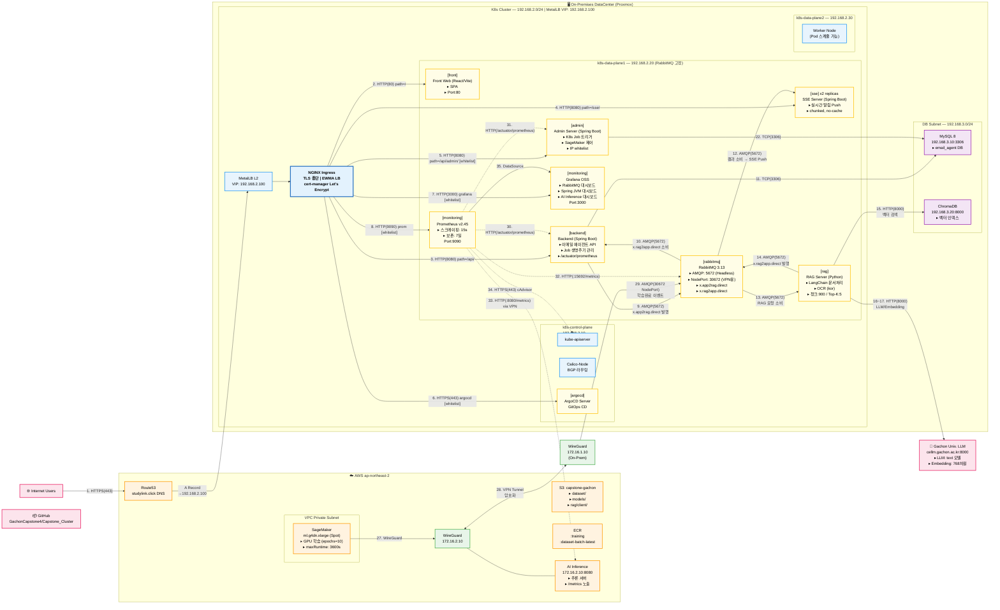

# Architecture Diagram Guide
> **목적**: 이 문서는 디자인 AI가 시스템 아키텍처 다이어그램을 생성할 수 있도록 작성된 설명서입니다.  
> 직접 다이어그램을 그리는 것이 아닌, 시스템 구조와 데이터 흐름을 정확히 기술합니다.
> Front pod 는 더이상 사용하지 않습니다. 응용 프로그램 앱 으로 프론트 대체

---

## 1. Architecture Summary (아키텍처 구조 요약)

```
ROOT
├── [Layer 1] On-Premises DataCenter (Proxmox Hypervisor)
│   ├── [Layer 2] Network: 192.168.2.0/24 (K8s Cluster LAN)
│   │   ├── MetalLB VIP: 192.168.2.100 (NGINX Ingress 진입점)
│   │   ├── [Layer 3] k8s-control-plane (192.168.2.10)
│   │   │   └── [Layer 4]
│   │   │       ├── kube-apiserver : K8s 클러스터 API 엔드포인트
│   │   │       ├── Calico-Node : BGP 기반 Pod 네트워크 라우팅
│   │   │       └── ArgoCD Server : GitOps 기반 CD 오케스트레이터
│   │   │
│   │   ├── [Layer 3] k8s-data-plane1 (192.168.2.20) [RabbitMQ 전용 노드]
│   │   │   └── [Layer 4]
│   │   │       ├── RabbitMQ Pod : AMQP 메시지 브로커 (학습완료·RAG 이벤트 큐)
│   │   │       │   ├── Exchange: x.app2rag.direct (Backend → RAG 요청)
│   │   │       │   └── Exchange: x.rag2app.direct (RAG → SSE 결과 전달)
│   │   │       ├── Backend Pod : Java Spring Boot - 이메일 에이전트 API 서버 (Job 생명주기 관리 및 DB 기록)
│   │   │       ├── SSE Pod x2 : Java Spring Boot - Server-Sent Events 실시간 알림 서버
│   │   │       ├── RAG Pod : Python LangChain - 문서 임베딩·벡터 검색·OCR 처리 서버
│   │   │       ├── Front Pod : React/Vite SPA - 사용자 웹 프론트엔드
│   │   │       ├── Admin Pod : Java Spring Boot - 관리자 API 서버 (K8s Job 트리거 및 SageMaker 제어)
│   │   │       ├── Prometheus Pod : 메트릭 수집 서버 (15s 주기 스크레이핑, 7일 보존)
│   │   │       ├── Grafana Pod : 메트릭 시각화 대시보드 (익명 뷰어 허용)
# │   │   │       └── Diagnostic Jobs (on-demand):
# │   │   │           ├── diag-network : 전체 노드 네트워크 진단 (3 병렬, NET_RAW 권한)
# │   │   │           ├── diag-os : 전체 노드 OS 상태 수집 (3 병렬)
# │   │   │           ├── diag-vpn : VPN 터널 연결 상태 점검 (traceroute/iperf to 172.16.1.10)
# │   │   │           ├── diag-k8s : 클러스터 상태 수집 (control-plane 전용 실행)
# │   │   │           ├── diag-mq : RabbitMQ 헬스 체크 및 큐 현황 수집
# │   │   │           └── dataset-collection-job : Python - Gmail 데이터 수집 후 S3 업로드
│   │   │
│   │   └── [Layer 3] k8s-data-plane2 (192.168.2.30)
│   │       └── [Layer 4] (Backend·SSE·RAG·Front Pod 스케줄 가능 Worker)
│   │
│   ├── [Layer 2] Network: 192.168.3.0/24 (DB Subnet)
│   │   ├── [Layer 3] DB Server (192.168.3.10)
│   │   │   └── [Layer 4] MySQL 8 : email_agent DB (사용자·Job·메일 데이터 영속 저장)
│   │   └── [Layer 3] VectorDB Server (192.168.3.20)
│   │       └── [Layer 4] ChromaDB (HTTP, port 8000) : 문서 임베딩 벡터 인덱스 저장소
│   │
│   └── [Layer 2] WireGuard VPN Tunnel (172.16.0.0/16)
│       ├── On-Prem VPN Endpoint: 172.16.1.10
│       └── → AWS VPN Endpoint: 172.16.2.10
│
├── [Layer 1] External Services (Internet)
│   └── [Layer 3] Gachon Univ. LLM Server (cellm.gachon.ac.kr:8000)
│       └── [Layer 4]
│           ├── LLM API (/v1): "text" 모델 - RAG 응답 생성
│           └── Embedding API (/v1): "embedding" 모델 (768차원) - 문서 벡터화
│
└── [Layer 1] AWS Cloud (ap-northeast-2)
    ├── [Layer 2] Route53: studylink.click DNS 관리 (Let's Encrypt DNS-01 인증)
    ├── [Layer 2] S3 Bucket: capstone-gachon
    │   ├── dataset/dataset_new.csv : 학습용 데이터셋
    │   ├── models/ : SageMaker 학습 완료 모델 아티팩트
    │   └── rag/client/ : 사용자 업로드 원본 문서
    ├── [Layer 2] ECR: 390403881443.dkr.ecr.ap-northeast-2.amazonaws.com/capstone/ecr
    │   ├── :training - SageMaker 학습 이미지
    │   └── :dataset-batch-latest - 데이터 수집 배치 이미지
    ├── [Layer 2] VPC Private Subnet (subnet-07de48e5094f09a36) + SG (sg-013368ce7154f148a)
    │   └── [Layer 3] SageMaker Training Instance (ml.g4dn.xlarge, Spot)
    │       └── [Layer 4]
    │           ├── Training Container : GPU 기반 딥러닝 모델 학습 (epochs=10, batch=32)
    │           └── → 학습 완료 후 WireGuard VPN → RabbitMQ NodePort 30672 이벤트 발행
    └── [Layer 2] VPN Endpoint (172.16.2.10)
        └── [Layer 3] AI Inference Server (172.16.2.10:8080)
            └── [Layer 4] AI Inference Service : 학습 모델 추론 서버 (Prometheus /metrics 노출)
```

---

## 2. Workflow Sequence (핵심 트래픽 시나리오)

### 시나리오 A: 사용자 문서 업로드 → RAG 질의응답 흐름

```
[사용자 브라우저]
    │
    │ 1. HTTPS (443): capstone.studylink.click 요청
    ▼
[pfSense Router/Firewall] → [MetalLB VIP: 192.168.2.100]
    │
    │ 2. TCP (80/443): L2 ARP 기반 라우팅
    ▼
[NGINX Ingress Controller] (cert-manager TLS 종단)
    │  path=/     → front-service:80
    │  path=/api/ → backend-service:8080
    │  path=/sse/ → sse-service:8080 (SSE: Connection keep-alive, no buffering)
    │
    │ 3. HTTP (8080): /api/ 요청 → Backend Pod
    ▼
[Backend Pod - Spring Boot]  ←→  [MySQL DB 192.168.3.10:3306] (5. TCP: Job 상태 기록)
    │
    │ 4. AMQP (5672): x.app2rag.direct Exchange에 RAG 요청 이벤트 발행
    ▼
[RabbitMQ StatefulSet - rabbitmq-headless.rabbitmq:5672]
    │
    │ 5. AMQP (5672): RAG Pod가 큐에서 메시지 소비
    ▼
[RAG Pod - Python LangChain]
    │  ├─ 6a. HTTP (8000): ChromaDB 192.168.3.20:8000 → 벡터 검색
    │  └─ 6b. HTTP (8000): cellm.gachon.ac.kr:8000/v1 → LLM 추론 / 임베딩 생성
    │
    │ 7. AMQP (5672): x.rag2app.direct Exchange에 결과 이벤트 발행
    ▼
[RabbitMQ] → [SSE Pod - Spring Boot]
    │
    │ 8. HTTP/1.1 SSE (8080): chunked transfer, 캐시 없음 → NGINX → 브라우저
    ▼
[사용자 브라우저 - 실시간 결과 수신]
```

---

<!-- ### 시나리오 B: Admin 서버 → SageMaker 학습 트리거 → 완료 알림 흐름

```
[관리자 브라우저 (VPN 또는 내부망: 10.0.0.0/24 or 192.168.2.0/24)]
    │
    │ 1. HTTPS (443): admin.studylink.click/api/admin/ (IP 화이트리스트 검증)
    ▼
[NGINX Ingress] → [Admin Pod - Spring Boot]
    │
    │ 2. HTTPS (443): GitHub API - GachonCapstone4/Capstone_Cluster
    │   main 브랜치 admin-manifest/job-manifest/ 경로에 Job YAML 커밋
    ▼
[GitHub Repository] ← ArgoCD가 폴링 감지
    │
    │ 3. HTTPS (443): ArgoCD가 변경 감지 → K8s API 서버에 Job 오브젝트 생성
    ▼
[kube-apiserver (192.168.2.10)] → [K8s Batch Job 스케줄링]
    │
    │ 4. (dataset-collection-job) HTTPS (443): AWS STS/S3/SageMaker API 호출
    │   └─ S3에 dataset_new.csv 업로드 (s3://capstone-gachon/dataset/)
    │
    │ 5. HTTPS (443): SageMaker CreateTrainingJob API
    │   └─ ECR 이미지 pull, ml.g4dn.xlarge Spot 인스턴스에서 학습 시작
    ▼
[SageMaker Training (AWS VPC - ap-northeast-2)]
    │  학습 완료 후 모델 → S3 models/ 저장
    │
    │ 6. AMQP (5672 via WireGuard VPN → 172.16.1.10 → 192.168.2.20:30672):
    │   RabbitMQ NodePort에 학습 완료 이벤트 발행 (RABBITMQ_HOST=192.168.2.20)
    ▼
[RabbitMQ NodePort 30672 → SSE Pod]
    │
    │ 7. SSE (8080 → NGINX → HTTPS): 관리자 브라우저에 학습 완료 푸시
    ▼
[관리자 브라우저 - 학습 완료 알림 수신]
```
-->

---

### 시나리오 C: Prometheus 메트릭 수집 → Grafana 시각화

```
[Prometheus Pod - monitoring namespace]
    │  15s 주기 스크레이핑
    ├─ 1. HTTP (/actuator/prometheus): Spring Boot Pods (backend, admin)
    │       annotation 기반 자동 discovery (prometheus.io/scrape: "true")
    ├─ 2. HTTPS (/api/v1/nodes/.../proxy/metrics/cadvisor): cAdvisor (모든 노드)
    ├─ 3. HTTP (/metrics, /metrics/per-object): RabbitMQ Headless Service:15692
    └─ 4. HTTP (:8080/metrics via WireGuard VPN): AWS AI Inference Server (172.16.2.10)
    │
    │ 데이터 저장 (7일 보존, PVC 마운트)
    ▼
[Grafana Pod - monitoring namespace]
    │  대시보드 3종 (Admin UI에 iframe embed):
    ├─ RabbitMQ 대시보드: grafana.studylink.click/d/rabbitmq-capstone-v9/...
    ├─ Spring Boot JVM 대시보드: grafana.studylink.click/d/ad7v97v/...
    └─ AI Inference 모니터링: grafana.studylink.click/d/adsbx4d/...
    │  (IP 화이트리스트: 10.0.0.0/24, 192.168.2.0/24)
    ▼
[관리자 브라우저]
```

---

## 3. Diagrams-as-Code (PlantUML C4 Model)

```plantuml
@startuml capstone-architecture
!include https://raw.githubusercontent.com/plantuml-stdlib/C4-PlantUML/master/C4_Container.puml

' ═══ 색상 클래스 정의 ═══
skinparam rectangle {
  BackgroundColor<<onprem>> #E8F4FD
  BorderColor<<onprem>> #2196F3
  BackgroundColor<<aws>> #FFF3E0
  BorderColor<<aws>> #FF9800
  BackgroundColor<<db>> #F3E5F5
  BorderColor<<db>> #9C27B0
  BackgroundColor<<vpn>> #E8F5E9
  BorderColor<<vpn>> #4CAF50
  BackgroundColor<<external>> #FCE4EC
  BorderColor<<external>> #E91E63
  BackgroundColor<<k8s-ns>> #FFFDE7
  BorderColor<<k8s-ns>> #FFC107
}

' ─────────────────────────────────────────
' Layer 1: On-Premises DataCenter
' ─────────────────────────────────────────
rectangle "On-Premises DataCenter\n(Proxmox Hypervisor)" <<onprem>> {

  rectangle "Network 192.168.2.0/24\nMetalLB VIP: 192.168.2.100" {

    rectangle "NGINX Ingress Controller\n(TLS Termination, EWMA Load Balancing)" as nginx

    rectangle "k8s-control-plane\n192.168.2.10 | K8s v1.31.14" {
      rectangle "kube-apiserver\n: K8s 클러스터 제어" as kube_api
      rectangle "Calico-Node\n: BGP Pod 네트워크 라우팅" as calico
      rectangle "[argocd ns]\nArgoCD Server\n: GitOps CD 오케스트레이터" <<k8s-ns>> as argocd
    }

    rectangle "k8s-data-plane1\n192.168.2.20 (RabbitMQ 고정)" {

      rectangle "[rabbitmq ns]\nRabbitMQ 3.13 StatefulSet\n: AMQP 메시지 브로커\nAMQP:5672 | UI:15672 | NodePort:30672\nExchange: x.app2rag.direct / x.rag2app.direct" <<k8s-ns>> as mq

      rectangle "[backend ns]\nBackend Pod (Spring Boot)\n: 이메일 에이전트 API\nJob 생명주기 관리 및 DB 기록\nPort:8080 | /actuator/prometheus" <<k8s-ns>> as backend

      rectangle "[sse ns]\nSSE Pod x2 (Spring Boot)\n: Server-Sent Events\n실시간 알림 Push 서버\nPort:8080" <<k8s-ns>> as sse

      rectangle "[rag ns]\nRAG Pod (Python LangChain)\n: 문서 임베딩·벡터검색·OCR\nPort:8090 | 청크크기:900 | TopK:5" <<k8s-ns>> as rag

      rectangle "[front ns]\nFront Pod (React/Vite SPA)\n: 사용자 웹 프론트엔드\nPort:80" <<k8s-ns>> as front

      rectangle "[admin ns]\nAdmin Pod (Spring Boot)\n: 관리자 API 서버\nK8s Job 트리거·SageMaker 제어\nIP whitelist: 10.0.0.0/24" <<k8s-ns>> as admin

'      rectangle "[admin ns - K8s Jobs]\nDiagnostic Jobs (on-demand)\n├ diag-network: 3노드 병렬 네트워크 진단\n├ diag-os: 3노드 병렬 OS 수집\n├ diag-vpn: VPN 터널 점검\n├ diag-k8s: 클러스터 상태 수집\n├ diag-mq: RabbitMQ 헬스체크\n└ dataset-collection-job: 데이터 수집·S3 업로드" <<k8s-ns>> as jobs

      rectangle "[monitoring ns]" <<k8s-ns>> {
        rectangle "Prometheus (v2.45)\n: 메트릭 수집·저장(7일)\nPort:9090 | 스크레이핑:15s" as prom
        rectangle "Grafana OSS\n: 메트릭 대시보드\nPort:3000 | 익명 뷰어" as grafana
      }
    }

    rectangle "k8s-data-plane2\n192.168.2.30" {
      rectangle "Worker Node\n(Pod 스케줄 가능)" as worker2
    }
  }

  rectangle "Network 192.168.3.0/24\n(DB Subnet)" <<db>> {
    rectangle "DB Server\n192.168.3.10" {
      rectangle "MySQL 8\n: email_agent DB\nPort:3306" as mysql
    }
    rectangle "VectorDB Server\n192.168.3.20" {
      rectangle "ChromaDB (HTTP)\n: 문서 임베딩 벡터 인덱스\nPort:8000" as chromadb
    }
  }

  rectangle "WireGuard VPN Tunnel\n172.16.0.0/16\nOn-Prem Endpoint: 172.16.1.10" <<vpn>> as vpn_onprem
}

' ─────────────────────────────────────────
' Layer 1: External Services
' ─────────────────────────────────────────
rectangle "External Services" <<external>> {
  rectangle "Gachon Univ. LLM Server\ncellm.gachon.ac.kr:8000" {
    rectangle "LLM API (/v1)\n: 'text' 모델 응답 생성" as llm
    rectangle "Embedding API (/v1)\n: 'embedding' 768차원 벡터화" as embed
  }
  rectangle "GitHub\nGachonCapstone4/Capstone_Cluster\nmain 브랜치" as github
  rectangle "Internet Users\n(Public)" as users
}

' ─────────────────────────────────────────
' Layer 1: AWS Cloud (ap-northeast-2)
' ─────────────────────────────────────────
rectangle "AWS Cloud (ap-northeast-2)" <<aws>> {
  rectangle "Route53\n: studylink.click DNS 관리\nLet's Encrypt DNS-01 검증" as route53
  rectangle "S3: capstone-gachon\n├ dataset/dataset_new.csv\n├ models/ (학습 아티팩트)\n└ rag/client/ (사용자 문서)" as s3
  rectangle "ECR\n390403881443.dkr.ecr\n├ :training\n└ :dataset-batch-latest" as ecr

  rectangle "VPC Private Subnet\nsubnet-07de48e5094f09a36\nSG: sg-013368ce7154f148a" {
    rectangle "SageMaker Training\nml.g4dn.xlarge (Spot)\n: GPU 딥러닝 모델 학습\nepochs=10 | batch=32\nmaxRuntime:3600s" as sagemaker
  }

  rectangle "WireGuard VPN Endpoint\n172.16.2.10" <<vpn>> as vpn_aws
  rectangle "AI Inference Server\n172.16.2.10:8080\n: 학습 모델 추론 서버\n/metrics Prometheus 노출" as ai_server
}

' ─────────────────────────────────────────
' 트래픽 흐름 화살표 (번호 = 시나리오 순서)
' ─────────────────────────────────────────

' 사용자 진입
users -[#2196F3]-> nginx : "1. HTTPS(443)\ncapstone/admin/\nargocd/grafana/prom\n.studylink.click"
route53 -[#FF9800]-> nginx : "DNS A Record\n→ 192.168.2.100\n(MetalLB VIP)"

' NGINX → 서비스 라우팅
nginx -[#2196F3]-> front : "2. HTTP(80)\npath=/"
nginx -[#2196F3]-> backend : "3. HTTP(8080)\npath=/api/"
nginx -[#2196F3]-> sse : "4. HTTP(8080)\npath=/sse/\n(SSE keep-alive)"
nginx -[#9C27B0]-> admin : "5. HTTP(8080)\npath=/api/admin/\n[IP whitelist]"
nginx -[#9C27B0]-> argocd : "6. HTTPS(443)\nargocd.studylink.click\n[IP whitelist]"
nginx -[#9C27B0]-> grafana : "7. HTTP(3000)\ngrafana.studylink.click\n[IP whitelist]"
nginx -[#9C27B0]-> prom : "8. HTTP(9090)\nprom.studylink.click\n[IP whitelist]"

' Backend ↔ 내부
backend -[#E91E63]-> mq : "9. AMQP(5672)\nx.app2rag.direct\nRAG 요청 발행"
backend <-[#E91E63]- mq : "10. AMQP(5672)\nx.rag2app.direct\n결과 이벤트 소비"
backend -[#9C27B0]-> mysql : "11. TCP(3306)\nJob 상태·메일 데이터 저장"

' SSE ↔ MQ
sse <-[#E91E63]- mq : "12. AMQP(5672)\n결과 이벤트 소비\n→ SSE Push"

' RAG ↔ 인프라
mq -[#E91E63]-> rag : "13. AMQP(5672)\nRAG 요청 소비"
rag -[#E91E63]-> mq : "14. AMQP(5672)\nx.rag2app.direct\n결과 발행"
rag -[#9C27B0]-> chromadb : "15. HTTP(8000)\n벡터 검색·저장"
rag -[#E91E63]-> llm : "16. HTTP(8000)\n/v1: LLM 추론 요청"
rag -[#E91E63]-> embed : "17. HTTP(8000)\n/v1: 문서 임베딩"

' [주석처리] Admin → GitOps 흐름
' admin -[#FF9800]-> github : "18. HTTPS(443)\nJob YAML 커밋\n(admin-manifest/job-manifest)"
' github -[#FF9800]-> argocd : "19. HTTPS(443)\n변경 감지 (폴링)\nGit Sync"
' argocd -[#FF9800]-> kube_api : "20. K8s API\nJob 오브젝트 생성"
' kube_api -[#FF9800]-> jobs : "21. 스케줄링\nJob Pod 실행"

' Admin → DB
admin -[#9C27B0]-> mysql : "22. TCP(3306)\n관리 데이터 저장"

' [주석처리] Dataset Job → S3 → SageMaker
' jobs -[#FF9800]-> s3 : "23. HTTPS(443)\nS3 SDK\ndataset 업로드"
' jobs -[#FF9800]-> sagemaker : "24. HTTPS(443)\nSageMaker API\n학습 Job 트리거"
' sagemaker -[#FF9800]-> s3 : "25. S3 PutObject\n학습 완료 모델 저장"
' sagemaker -[#FF9800]-> ecr : "26. ECR Pull\n학습 컨테이너 이미지"

' SageMaker → VPN → RabbitMQ (학습완료 이벤트)
sagemaker -[#4CAF50]-> vpn_aws : "27. WireGuard\n172.16.0.0/16"
vpn_aws <-[#4CAF50]-> vpn_onprem : "28. WireGuard VPN Tunnel\n(암호화 터널)"
vpn_onprem -[#4CAF50]-> mq : "29. AMQP(30672 NodePort)\n학습완료 이벤트 발행\nRABBITMQ_HOST=192.168.2.20"

' Prometheus 스크레이핑
prom -[#9C27B0]-> backend : "30. HTTP(/actuator/prometheus)\n15s 스크레이핑"
prom -[#9C27B0]-> admin : "31. HTTP(/actuator/prometheus)"
prom -[#9C27B0]-> mq : "32. HTTP(:15692/metrics)\nRabbitMQ 메트릭"
prom -[#4CAF50]-> ai_server : "33. HTTP(8080/metrics)\nVPN 경유 AI 서버 메트릭"
prom -[#9C27B0]-> kube_api : "34. HTTPS(443)\ncAdvisor (노드별)"
prom -[#9C27B0]-> grafana : "35. HTTP(3000)\nDataSource 연동"

' AI Inference Server (VPN)
vpn_aws -[#4CAF50]-> ai_server : "내부 통신"
ai_server <-[#4CAF50]-> vpn_aws

@enduml
```

---

## 4. Mermaid.js (렌더링 최적화 버전 — LR 방향)



---

## 5. 컴포넌트 상세 명세표

| 컴포넌트 | 네임스페이스 | 이미지 | 포트 | 역할 | 연결 대상 |
|---------|------------|-------|------|------|----------|
| Backend | backend | suhannugul/email-agent | 8080 | 이메일 에이전트 API, Job 생명주기 관리 | RabbitMQ:5672, MySQL:3306 |
| SSE Server | sse | suhannugul/capstonesse | 8080 | 실시간 Server-Sent Events Push (2 replicas) | RabbitMQ:5672 |
| RAG Server | rag | suhannugul/capstonerag | 8090 | 문서 임베딩, 벡터 검색, OCR, LLM 질의 | ChromaDB:8000, LLM:8000, RabbitMQ:5672 |
| Frontend | front | suhannugul/capstonefront | 80 | React/Vite SPA | (정적 파일 서빙) |
| Admin Server | admin | suhannugul/capstoneadmin | 8080 | 관리자 API, K8s Job/SageMaker 제어 | GitHub API, MySQL:3306, RabbitMQ:5672 |
| RabbitMQ | rabbitmq | rabbitmq:3.13-management | 5672/15672/30672 | AMQP 메시지 브로커 (StatefulSet, 5Gi PVC) | Backend, SSE, RAG, SageMaker |
| Prometheus | monitoring | prom/prometheus:v2.45.0 | 9090 | 메트릭 수집 (15s), 7일 보존 | All Pods, RabbitMQ, AI Server |
| Grafana | monitoring | grafana/grafana-oss | 3000 | 메트릭 대시보드 (3종) | Prometheus |
| ArgoCD | argocd | (helm 설치) | 443 | GitOps CD (GitHub → K8s) | kube-apiserver, GitHub |
| MySQL | - (외부) | - | 3306 | email_agent 데이터베이스 | Backend, Admin |
| ChromaDB | - (외부) | - | 8000 | 벡터 인덱스 저장소 | RAG Server |
| SageMaker | AWS | ECR :training | - | GPU 딥러닝 학습 (ml.g4dn.xlarge, Spot) | S3, RabbitMQ(via VPN) |
| AI Inference | AWS (VPN) | - | 8080 | 학습 모델 추론 서버 | Prometheus(via VPN) |

---

## 6. 네트워크 경계 및 보안 정책 요약

| 경계 | 제어 수단 | 허용 대상 |
|------|----------|---------|
| 공인 인터넷 → Ingress | NGINX SSL Redirect (HTTPS Only) | 전체 공인 IP |
| Ingress → Admin/ArgoCD/Grafana/Prom | IP Whitelist | 10.0.0.0/24, 192.168.2.0/24 |
| On-Prem ↔ AWS SageMaker | WireGuard VPN (172.16.0.0/16) | 터널 양단 엔드포인트만 |
| SageMaker → RabbitMQ | NodePort 30672 (VPN 내부망) | 172.16.x.x VPN 대역 |
| TLS 인증서 | cert-manager + Let's Encrypt DNS-01 (Route53) | studylink.click 전 서브도메인 |
| K8s RBAC | job-runner-sa (Admin Pod) | admin namespace Job 생성·조회 권한 |
| Dev Team | dev-clusterrole (ClusterRoleBinding) | 클러스터 읽기 권한 |

## 디자인규칙
디자인 규칙:
- 16:9 가로형
- 흰 배경

컬러 규칙:
- 사용자/Frontend 영역: 연한 파랑
- Backend 영역: 연한 슬레이트 그레이
- Queue / Messaging 영역: 연한 앰버
- AI / RAG / 처리 서비스 영역: 연한 민트 또는 연한 보라
- 저장소 / 외부 API 영역: 연한 보라 또는 연한 그린
- 바탕은 흰색

구성 규칙:
- 제목은 상단 좌측에 크게 배치
- 오른쪽 상단에는 작은 캡션 배치 가능
- 핵심 흐름은 중앙 lane과 화살표만으로 이해되게 구성
- 세부 설명보다 컴포넌트 이름, 큐 이름, API 이름 중심으로 표현

